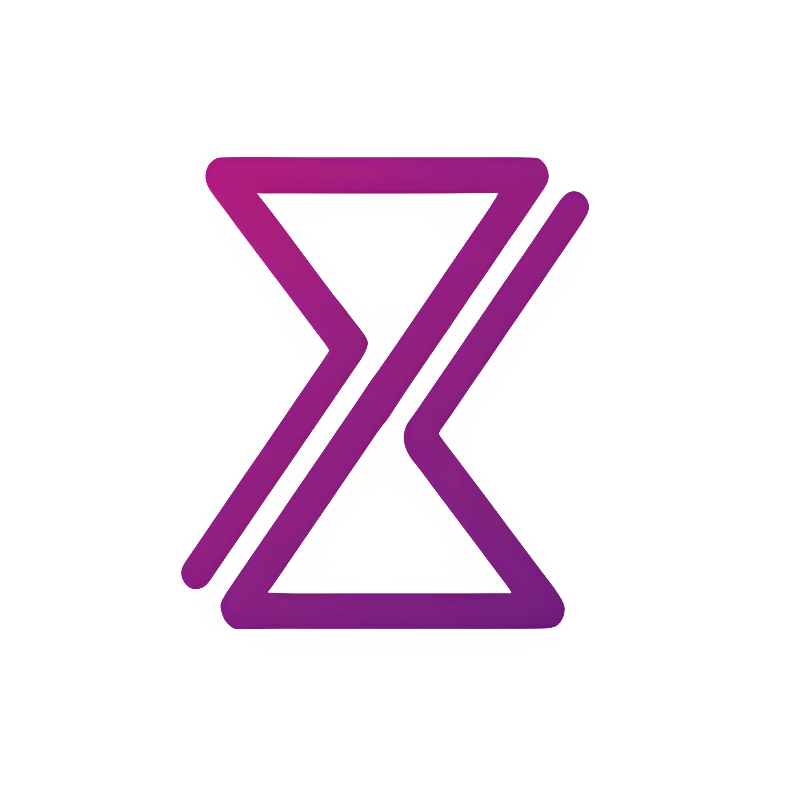

<div align="center">



# MystiqDev — Front-End Developer

[](https://mystiqdev.github.io)
[](https://github.com/MystiqDev)
[](https://x.com/my_st45)
[](https://www.linkedin.com/in/mystique-x-9572b93a7/)
[](https://www.instagram.com/mysti_qdev/)

**Front-end developer from Oman building clean, fast, and beautifully interactive websites.**  
Pure HTML · CSS · Vanilla JavaScript — no frameworks, no bloat. Just craftsmanship.

</div>

---

## 👋 About Me

Hi, I'm **Mysti** — a self-taught front-end developer based in **Oman**. I specialise in crafting responsive, detail-oriented websites that load fast, look sharp on every device, and feel genuinely *made* rather than assembled.

I build exclusively with **pure HTML, CSS, and Vanilla JavaScript** — a deliberate choice to keep sites lean, performant, and maintainable without framework overhead.

- 🕐 **2+ years** of continuous practice
- ✅ **3+ projects** completed and deployed
- 📱 **Mobile-first** approach on every build
- ⚡ **100% Vanilla** — zero framework dependencies
- 🌐 **Available for freelance work**

---

## 🛠️ Tech Stack

<div align="center">


</div>

| Skill | Proficiency |
|---|---|
| HTML & CSS | ████████████░░ 92% |
| JavaScript | ██████████░░░░ 70% |
| Responsive Design | ████████████░░ 88% |
| UI / UX Sensibility | ███████████░░░ 80% |

---

## 🚀 Projects

### [SiliconVPN](https://mystiqdev.github.io/silicon-vpn-fictinonal) &nbsp; `Landing Page`
> A polished landing page for a fictional VPN service — bold hero section, feature breakdowns, pricing cards, and persuasive copy structure.

[](https://github.com/MystiqDev/silicon-vpn-fictinonal)
[](https://mystiqdev.github.io/silicon-vpn-fictinonal)
`HTML` `CSS` `JavaScript`

---

### [Logan's Cafe](https://mystiqdev.github.io/logan-s-cafe-fictional/) &nbsp; `Business Site`
> A warm, atmospheric site for a fictional café — inviting aesthetic, clear menu presentation, and a layout that builds trust and drives foot traffic.

[](https://github.com/MystiqDev/logan-s-cafe-fictional)
[](https://mystiqdev.github.io/logan-s-cafe-fictional/)
`HTML` `CSS` `JavaScript`

---

### 🔧 Project #03 — *Coming Soon*
> Currently in development. Stay tuned — something new is on the way.


---

## 🧰 Services

| Service | Description |
|---|---|
| 📱 **Responsive Design** | Fluid layouts that work flawlessly on every screen — from phones to ultrawide monitors |
| ⚡ **Quick Development** | Fast delivery without cutting corners. Polished details, intentional code |
| ✨ **Interactive Pages** | Smooth animations and micro-interactions that give your site personality |
| `</>` **Vanilla Coding** | Pure HTML, CSS & JS — lean, fast-loading, and maintainable long-term |
| 🎯 **Landing Pages** | Conversion-focused pages that guide visitors and compel them to act |
| 💼 **Business Sites** | Professional websites that build credibility and showcase your brand |

---

## 🔄 How I Work

```
01 Discovery & Brief  →  02 Design & Build  →  03 Review & Deliver
```

1. **Discovery & Brief** — We align on your goals, brand, content, and references
2. **Design & Build** — I craft a responsive, polished layout tailored to your brand
3. **Review & Deliver** — You review, request tweaks, and receive clean commented code ready to deploy

> Revisions are always included.

---

## 💬 FAQ

<details>
<summary><b>What do you need from me to get started?</b></summary>
<br>
Your content (text & images), logo if you have one, colour preferences, and a few example sites you like. That's all I need.
</details>

<details>
<summary><b>Will my website be mobile responsive?</b></summary>
<br>
Absolutely. Every site I build is fully responsive and tested on mobile, tablet, and desktop.
</details>

<details>
<summary><b>Do you provide hosting or a domain?</b></summary>
<br>
No — you'll need your own hosting and domain. I can guide you through the setup if you're unsure where to start.
</details>

<details>
<summary><b>Can you add more pages later?</b></summary>
<br>
Yes. Additional pages are available as an extra service — reach out whenever you're ready to expand.
</details>

<details>
<summary><b>Do you build e-commerce websites?</b></summary>
<br>
I currently focus on static and business websites. Contact me first if you have specific e-commerce requirements and we'll discuss what's possible.
</details>

<details>
<summary><b>Can we talk before I place an order?</b></summary>
<br>
Yes — I always recommend it. Messaging first helps us align on requirements and makes the whole process smoother.
</details>

---

## 📊 GitHub Stats

<div align="center">


</div>

---

## 📬 Hire Me

Available for freelance projects — reach out on any platform below or send a message directly from my [portfolio site](https://mystiqdev.github.io).

<div align="center">

[](https://www.fiverr.com/s/DBbLZDo)
[](https://contra.com/mystique72_jug14sx9)
[](https://www.guru.com/freelancers/shahab-m)
[](https://www.upwork.com/freelancers/~01f1c8b9c3e2a7b9e5)

📧 mystique20084589@gmail.com

</div>

---

<div align="center">

*© 2026 MystiqDev — Built with HTML, CSS & Vanilla JS*

</div>
